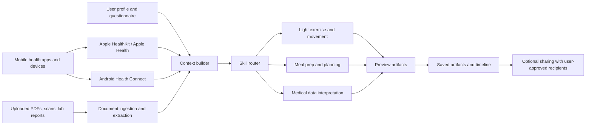
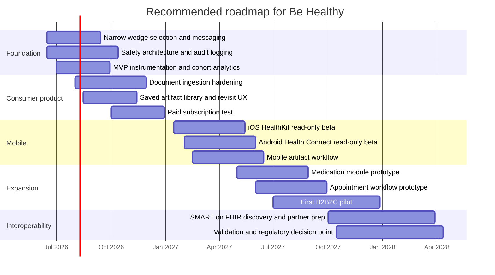

# Be Healthy investor research report

## Executive summary

Be Healthy has a credible investor story, but only if it is positioned as a **health self-management copilot** rather than an “AI doctor.” The strongest near-term wedge is not broad telehealth or clinical decision-making. It is a structured, persistent health workspace for people managing recurring or chronic issues, habits, food decisions, and light movement routines, where conversation is turned into **saveable artifacts** and improved over time as the user adds context. That framing is aligned with today’s market pull: in the U.S., chronic diseases remain the leading causes of death and disability and are major drivers of health spending; in the EU, more than one-third of adults report a longstanding illness or health problem; and consumers are already using AI for health questions at meaningful scale. citeturn19view1turn19view2turn19view3turn15view3

The product concept matches a real behavior shift. KFF found that about **32% of U.S. adults** used AI tools or chatbots in the past year for health information or advice, while **77%** are concerned about privacy and **41%** of AI-health users have already uploaded personal medical information into an AI tool. ONC found that in 2024, **more than three in four** people were offered online access to their records and **65%** accessed those records at least once. That combination matters: consumers want quick interpretation, but they do not trust general-purpose AI enough to hand over sensitive health context casually. A product that combines context, boundaries, artifacts, and privacy controls is therefore better positioned than a generic chatbot wrapper. citeturn19view3turn19view0

The main risk is regulatory and trust drift. In the U.S., software that helps users self-manage a disease **without specific treatment suggestions** can fall into lighter-touch FDA territory, but patient-facing software that starts to behave like diagnosis or treatment support can move toward medical-device scrutiny. In the EU, software can fall under MDR/IVDR based on **intended purpose**, and the AI Act is already in force, with broader applicability continuing into 2026 and beyond. The right investor narrative is therefore: **wellness-first, clinically conservative, compliance-aware, and progressively validated**. citeturn17view2turn17view3turn18view4turn17view0

The biggest strategic recommendation is focus. Investors in 2026 are funding digital health, but selectively: Rock Health reported **$4.0B** raised across **110 deals** in Q1 2026, with **59% of capital concentrated in 12 megadeals**. A broad “personal health assistant for everyone” pitch is too diffuse for that market. A sharper story is: **Be Healthy turns fragmented personal health data into clear next steps and reusable plans for people managing recurring conditions and building healthier routines**. The split-pane workflow, saveable output layer, document ingestion, and bounded skill system are all assets for that story. citeturn14view3

## Product assessment and positioning

Based on the founder description and the user-supplied screenshots, Be Healthy already has the foundations of a differentiated workflow: a main chat interface, a separate preview panel for generated artifacts, persistent saved outputs, document ingestion, provider extraction, a user profile, and a bounded intake plus skill system. That is more than “chat with an LLM.” It is a **context-building and artifact-producing workflow**.

What stands out in the screenshots is the emphasis on a **two-pane experience**: chat on one side, generated output on the other. For investors, that matters because it implies a product architecture built around **deliverables**, not just answers. In consumer health, answers are cheap; structured outputs that can be saved, revisited, compared, edited, and eventually shared are harder to replace. That is the most defensible part of the product concept.

The six-question intake and the three bounded skills are also strategically useful. They create a narrower operating envelope for a model that would otherwise be too open-ended in health contexts. That is directionally consistent with WHO’s and NIST’s emphasis on health-AI governance, bounded risk management, and accountable deployment rather than unconstrained automation. citeturn20view1turn17view4

The investor-ready positioning should be:

| Use this framing | Avoid this framing |
| --- | --- |
| Personal health workspace | AI doctor |
| Self-management copilot | Diagnostic engine |
| Context-aware health artifact generator | Clinical decision-maker |
| Document-to-understanding workflow | Medical truth oracle |
| Wellness-first, clinically conservative | Replacing care teams |

That positioning is not just messaging polish. It directly affects regulatory exposure. FDA says it will exercise enforcement discretion for software that helps patients self-manage disease **without specific treatment suggestions**, while patient-facing device software with higher-risk medical functions is more likely to draw oversight. In the EU, software can qualify as medical-device software based on intended purpose, even when it runs as an app or cloud service. citeturn17view2turn18view4

The most investor-compelling internal product thesis is this:

**Be Healthy is building a longitudinal personal health context layer.**  
The chat is the interface, but the moat is the context graph: profile data, uploaded documents, extracted providers, future medication lists, future appointment state, and future mobile health signals. The preview panel then converts that context into reusable artifacts: plans, explanations, summaries, and routines.

That matters because consumer AI health demand is moving from “answer my question” toward “help me decide what to do next.” Rock Health found that one in three respondents had used AI chatbots for health information, **64%** of AI-health users used them weekly or more, and **81%** reported taking at least one action after interacting with them. Be Healthy’s artifact layer is well aligned with that shift from information to action. citeturn15view3turn15view2

## Market opportunity and sizing

The demand backdrop is real. In the U.S., CDC says chronic diseases such as heart disease, cancer, and diabetes are the leading causes of death and disability and major drivers of the nation’s healthcare costs. In Europe, OECD reports that **35% of adults in the EU** reported living with a longstanding illness or health problem in 2023. At the same time, ONC reports strong growth in online record access, and KFF shows that consumers are increasingly comfortable asking AI about health even while remaining worried about privacy. This is exactly the kind of environment in which a context-rich, consumer-facing health copilot can emerge. citeturn19view1turn19view2turn19view0turn19view3

A venture-friendly “why now” slide can therefore rest on four facts:

- People already seek health help outside the clinic.  
- Their records are increasingly digital and accessible.  
- They are already testing AI for interpretation.  
- Generic AI tools create privacy, trust, and follow-through gaps that a dedicated product can solve. citeturn19view0turn19view3turn15view3

Because launch geography is unspecified, the most rigorous investor model is a **bottom-up U.S. sample calculation** with EU expansion as upside, not a hand-wavy global TAM slide. The U.S. denominator is cleaner, and reimbursement, pricing, and regulatory sequencing are easier to explain. The EU should be sized country by country after the first launch market is chosen.

### Bottom-up TAM and SAM framework

The table below is an **illustrative framework**, not a forecast. Population and adoption inputs use public sources; pricing and reachable-share assumptions should later be replaced by real product data.

| Layer | Formula | Sample input | Sample output | Notes |
| --- | --- | --- | --- | --- |
| Total U.S. population | Census-based population | 340.1M total population | 340.1M | Census Reporter’s 2024 ACS-based U.S. population figure is 340,110,980; U.S. Census QuickFacts shows 21.5% under 18. citeturn13search10turn14view0 |
| U.S. adult population proxy | Total population × 78.5% | 340.1M × 78.5% | **267.0M** | Uses QuickFacts under-18 share as a simple adult proxy. citeturn14view0turn13search10 |
| AI-health TAM | Adults × 32% AI-for-health usage | 267.0M × 32% | **85.4M** | KFF found 32% of adults use AI for health information/advice. citeturn19view3 |
| Near-term chronic digital SAM | Adults × 60% chronic disease × 65% portal access × 32% AI usage | 267.0M × 60% × 65% × 32% | **33.3M** | CDC: 6 in 10 U.S. adults have a chronic disease. ONC: 65% accessed records in 2024. KFF: 32% AI-health usage. citeturn1search1turn19view0turn19view3 |
| Illustrative 3–5 year SOM | SAM × 0.5% to 1.5% | 33.3M × 0.5%–1.5% | **167K–500K** | Reachable share assumption; replace with real cohort data later. |
| Illustrative ARR | SOM × $12 PMPM × 12 | 167K–500K × $144/year | **$24M–$72M ARR** | Illustrative consumer subscription ARPU; not a market data claim. |

A more conservative investor conversation can use the same framework but narrow the wedge further to one use case, such as “people with recurring lab results, medication lists, and diet/routine questions,” or “people with cardiometabolic, gastrointestinal, thyroid, or women’s-health routines.” That typically improves credibility because it implies a better onboarding flow, a clearer data model, and a more understandable retention story.

For Europe, the directional upside is substantial, but the deck should not use a single pan-EU revenue number unless target countries are selected. What is solid today is that the EU population reached **450.4 million** on 1 January 2025, the population continued to age, and more than one-third of adults report a longstanding illness or health problem. That supports expansion logic, but not a precise pan-EU monetization model yet. citeturn14view1turn14view2turn19view2

## Competitive landscape and differentiation

Be Healthy sits at the intersection of several crowded categories: symptom checking, health navigation, nutrition planning, habit change, medication management, and personal health records. That sounds like a weakness until it is reframed correctly: the opportunity is **not** to beat each category leader at its own specialty. It is to own the **cross-category personal context layer** and the **artifact workflow** those point solutions do not fully solve.

### Competitor comparison

| Product | Official positioning | What it appears to do well | Gap that Be Healthy can target |
| --- | --- | --- | --- |
| **Ada** citeturn19view5turn10search8turn19view4 | AI-powered symptom assessment, medical library, care navigation | Strong symptom-assessment brand; proven navigation outcomes in provider settings | Less obviously centered on persistent user context, uploaded documents, and saveable multi-skill artifacts |
| **Healthily Dot** citeturn21view0 | AI health navigation platform; medically validated information; Class IIa EU device | Strong navigation/compliance posture; signposting and safe prediction framing | More enterprise navigation-oriented than personal health workspace-oriented |
| **K Health** citeturn19view7turn10search22 | Integrated primary care using clinical AI in provider workflows | Stronger care-delivery model, clinical workflow integration, 24/7 access with providers | Competes as virtual care infrastructure, not as self-serve artifact-centric health workspace |
| **Medisafe** citeturn19view8turn10search23 | Medication management app with appointments and measurements | Clear medication adherence use case and strong retention hooks | Narrower than Be Healthy’s planned document + diet + movement + interpretation stack |
| **MyFitnessPal Premium+** citeturn19view9turn19view10turn21view1 | Nutrition tracking with Premium+ meal planning, recipes, grocery integration | Excellent food logging and meal-planning wedge; proven subscription model | Weak on medical document interpretation and personalized health context outside nutrition |
| **Noom** citeturn21view2turn16search3 | Psychology-based weight-loss/habit-change platform with coaching and AI support | Established habit-change proposition; combines content, plans, and support | Oriented to weight management behavior change, not broad longitudinal health context |

Two conclusions follow from that table.

First, Be Healthy should **not** pitch itself as a generalized replacement for Ada, K Health, Medisafe, Noom, and MyFitnessPal all at once. That sounds unfocused. Instead, it should say: **those products solve slices of the problem; Be Healthy is building the personal health layer that can combine slices into one ongoing workflow**.

Second, differentiation depends on staying disciplined around what is actually novel in this product:

- a **split-pane chat-to-artifact workflow**,  
- **document ingestion and provider extraction**,  
- **six-question intake before answer generation**,  
- **bounded skills rather than unrestricted chat**, and  
- a future **personal data loop** from profile, docs, apps, meds, and appointments.

Those are the ingredients of a defensible story. “LLM for health” is not.

The monetization benchmarks from adjacent consumer products also help anchor an investor narrative. MyFitnessPal positions Premium+ at **$99.99 annually** with meal planning and grocery-linked features; Noom lists a **$209 annual** plan for Noom Weight in its support materials. That suggests consumers already pay for structured health planning and habit-management software when the value is concrete and repeatable. Be Healthy’s challenge is to prove that its artifact-and-context layer drives the same or better retention. citeturn19view10turn16search3

## Regulatory, privacy, safety, and technical notes

The product should be pitched, built, and roadmapped with regulation in mind from day one. The central strategic rule is simple: **claims create obligations**.

In the U.S., FDA says it focuses on software functions that meet the definition of a device and present greater risk, while it intends to exercise enforcement discretion for lower-risk functions, including ones that help patients self-manage disease **without providing specific treatment suggestions**. FDA’s CDS guidance also makes clear that patient- or caregiver-facing software can still fall within device oversight depending on what it does. In the EU, the Commission’s software guidance says intended purpose determines whether software falls within MDR/IVDR, and those criteria also apply to apps operating on mobile devices or in the cloud. citeturn17view2turn17view3turn18view4

That means Be Healthy’s present-state pitch should avoid explicit diagnostic or treatment claims. “Medical-data interpretation” is the most sensitive of the three skills. Until there is a formal regulatory strategy and validation plan, that skill should be framed as:

- explanation of documents and lab results in plain language,  
- question preparation for a clinical visit,  
- tracking and contextualizing changes over time, and  
- care-navigation prompts when red flags appear.

In Europe, the AI Act entered into force on **1 August 2024** and becomes broadly applicable on **2 August 2026**, with phased obligations along the way. Separately, the EHDS Regulation entered into force in **March 2025**, beginning a transition period for health-data sharing infrastructure. For privacy, GDPR treats health data as a special category with tighter processing rules. In the U.S., health apps cannot assume HIPAA is the whole story: the FTC’s Health Breach Notification Rule covers vendors of personal health records and related entities, and the GoodRx case shows that consumer health apps face real enforcement risk for advertising use or unauthorized sharing of health data. citeturn17view0turn17view1turn7search21turn17view5turn20view3

### Risk assessment and mitigation checklist

The checklist below synthesizes FDA, EU, HHS, FTC, WHO, and NIST guidance into what matters most for this product now. citeturn17view2turn18view4turn18view5turn17view5turn20view1turn17view4

| Risk area | Why it matters | Practical mitigation now |
| --- | --- | --- |
| Intended-use drift | Product copy, prompts, and outputs can quietly drift from “self-management” to diagnosis/treatment | Review all public claims, onboarding copy, and output formats against a regulatory checklist before release |
| Medical device classification | In both U.S. and EU, patient-specific clinical claims can change the regulatory category | Keep v1 wellness-first; treat “medical-data interpretation” as educational explanation and question-prep |
| Privacy and lawful basis | Health data is highly sensitive under GDPR and high-risk under FTC privacy scrutiny | Explicit consent, layered notices, purpose limitation, and granular data permissions |
| Health-breach exposure | Consumer health records can trigger FTC breach notifications even outside HIPAA-style settings | Adopt breach playbooks and vendor contracts early; do not wait until enterprise deals |
| Security baseline | Strong security becomes mandatory once records, meds, or provider data are stored | Encryption in transit and at rest, role-based access, secrets management, audit logs, MFA for staff, least privilege |
| Unsafe output | LLMs can hallucinate, overstate certainty, or miss red flags | Retrieval grounding, rule-based safety layer, emergency escalation logic, confidence-aware UI, refusal policies |
| Medication risk | Med advice is a high-trust area and mistakes can be dangerous | Do not rely on open-ended LLM output for med changes or interaction judgments; use deterministic sources and clear escalation |
| Document extraction errors | OCR/ingestion mistakes can corrupt the care context | Show provenance, extracted fields, and user confirmation before reuse downstream |
| Vulnerable-user scenarios | Users may ask crisis, urgent, or emotionally distressed questions | Add hard-coded crisis pathways, local emergency guidance, and symptom red-flag escalation |
| Auditability | Investor, regulator, and enterprise trust all require traceability | Log prompt version, model version, source context, output category, and safety flags |

### Technical integration notes for the planned mobile app

The mobile strategy is viable, but it should be sequenced carefully.

On iOS, **HealthKit** provides a central repository for health and fitness data on iPhone and Apple Watch, and Apple requires fine-grained authorization for each data type an app wants to read or write. Apple’s privacy documentation also says information obtained through HealthKit may **not** be used for advertising or similar services. That means the first iOS integration should be **read-only and purpose-limited**, with explicit in-app value explanations for every requested signal. citeturn8search0turn8search4turn9search1

For medical records on Apple devices, Health Records allows records to be downloaded directly from providers to the user’s device. Apple says those records are stored in encrypted form and protected by the device passcode, and the records should not be treated as a substitute for official health records or professional judgment. That is useful for product design: imported records should support explanation and organization, not be treated as unquestionable ground truth. Apple also already supports medication scheduling, reminders, logging, and PDF export in Health, which means Be Healthy’s future medication feature should interoperate where possible rather than recreate everything from scratch. citeturn18view3turn18view2turn21view3

On Android, **Health Connect** is the right near-term abstraction layer. Google says it stores and structures health and fitness data and allows apps to request access to **specific data types rather than broad permissions**. The developer flow also requires explicit manifest permissions and a privacy-policy rationale screen. This again argues for a **read-only, minimal-permission first release**. citeturn17view8turn18view0turn18view1

For future provider and record connectivity, **SMART on FHIR** is the long-term standard path. HL7’s SMART App Launch framework supports patient apps that launch standalone or from a portal, with registration, OAuth authorization, token exchange, and FHIR API access. That is the right architecture if Be Healthy later wants deeper patient-portal connections or provider-side deployments. citeturn22view0

### Recommended product-data flow

The right architecture is a **separation model**: ingest and store sensitive user data in a governed health-data layer, build a minimal context bundle for each request, then pass that bundle to a bounded skill engine rather than sending the raw longitudinal record to the model by default.

This design is consistent with NIST’s risk-management framing for generative AI and WHO’s emphasis on governance, accountability, and human rights in health AI. citeturn17view4turn20view1turn20view0

## Investor deck structure and copy

The deck should tell a focused story: **problem → product workflow → why now → wedge → business model → disciplined roadmap**. Because the company is at MVP stage with no physicians and no clinical validation, the deck should not try to sell clinical superiority yet. It should sell user behavior, workflow advantages, and a credible path to trust.

### One-page elevator pitch

Be Healthy is building an AI-powered personal health workspace for people who already use digital tools to understand their bodies, but still struggle to turn scattered data into clear action. Today, millions of consumers bounce between generic chatbots, patient portals, PDFs, food trackers, medication reminders, and notes apps. The result is fragmented context, low trust, and advice that is easy to lose and hard to reuse.

Be Healthy’s approach is different. The product combines a chat interface with a preview panel that turns conversation into saveable health artifacts: simple meal plans, movement routines, document explanations, and structured next steps. A short intake qualifies the request before the system responds. Users can start with no data, but the product gets better as they add a profile, upload medical documents, and later connect mobile health data sources. That creates a compounding personalization loop.

The near-term positioning is not “AI doctor.” It is “health self-management copilot.” That matters because consumers are already asking AI for treatment options, document explanations, and medication information, while remaining highly concerned about privacy and trust. Be Healthy can win by being more structured, more contextual, and more reusable than generic AI chat, while staying more consumer-friendly and cross-functional than today’s single-purpose apps. In a market where digital health capital is active but selective, the company’s best story is a focused wedge into chronic and recurring-condition self-management, with a clear path to mobile data integration, medication and appointment workflows, and later provider connectivity. citeturn19view3turn15view3turn19view0turn14view3

### Suggested slide order and copy

#### Slide headline

**Your health data is everywhere, but usable guidance is nowhere**

- Patients and wellness users now manage symptoms, lab results, food choices, routines, and records across many disconnected tools.
- Chronic disease burden is high in the U.S., and more than one-third of EU adults report a longstanding illness or health problem.
- AI use for health is already mainstream enough to matter, but trust and privacy remain unresolved. citeturn19view1turn19view2turn19view3

#### Slide headline

**Be Healthy is a personal health workspace, not just a chatbot**

- Chat on the left, generated artifact on the right.
- Every conversation can become a saveable plan, explanation, or routine.
- The product improves as users add profile data, documents, and eventually mobile health signals.

#### Slide headline

**Why users care**

- People want quick answers, private exploration, and help before or between appointments.
- 65% of Americans accessed online records in 2024.
- 32% used AI for health advice, and many already upload personal medical data into AI tools. citeturn19view0turn19view3

#### Slide headline

**How it works**

- A brief six-question intake qualifies the request.
- The system routes the user into one of three bounded skills: movement, meal planning, or medical-data interpretation.
- Outputs appear in a preview panel and can be saved for later use.
- More user context drives better personalization.

#### Slide headline

**Why Be Healthy can be different**

- Generic chat has no memory of your body, records, providers, routines, or prior artifacts.
- Point solutions solve only one layer: symptom checks, meal plans, medications, or coaching.
- Be Healthy combines context, structure, and reusable outputs in one workflow. citeturn19view5turn21view0turn19view7turn19view8turn21view1turn21view2

#### Slide headline

**Focused market entry**

- Start with recurring-condition and self-management users, not the entire wellness market.
- Use a bottom-up model anchored in digitally active, AI-ready adults.
- Launch geography is unspecified today; use U.S. as the first commercial modeling base and add EU country by country. citeturn19view0turn19view3turn19view2

#### Slide headline

**Business model**

- Consumer freemium with paid subscription for saved artifacts, richer personalization, premium plans, and future data integrations.
- Later B2B2C opportunities with clinics, employers, and condition programs.
- Long-term upside from provider connectivity and care-management workflows, but not the initial story. citeturn19view10turn16search3turn17view10turn17view11

#### Slide headline

**Why now**

- Consumers are adopting AI for health faster than institutions are adapting.
- Digital records are increasingly accessible.
- Digital health funding is active, but investors want focused, defensible companies.
- The winners will own the step between fragmented health data and usable action. citeturn19view3turn19view0turn14view3turn15view3

#### Slide headline

**Trust, safety, and compliance are part of the product**

- Wellness-first positioning reduces early regulatory risk.
- Privacy-by-design and minimal-permission mobile integrations are essential.
- Bounded skills, provenance, escalation logic, and auditability are product features, not legal afterthoughts. citeturn17view2turn18view4turn17view5turn20view1turn17view4

#### Slide headline

**What this round unlocks**

- Harden the MVP and validate one narrow wedge.
- Launch mobile with read-only health-data integrations.
- Prove activation, artifact retention, paid conversion, and safety metrics.
- Build toward medication, appointments, and interoperable records once the base loop works.

## Go-to-market, monetization, KPIs, and roadmap

The go-to-market strategy should match the product’s actual maturity. The current state is a barebone MVP with no physicians and no clinical validation. That argues against a provider-first or payer-first launch as the main story. The best initial route is **consumer-first with disciplined wedge selection**, followed by selective B2B2C pilots once both trust and retention are demonstrated.

### Go-to-market phases

| Phase | Recommended focus | Why this is the right sequence |
| --- | --- | --- |
| **Phase one** | DTC/self-serve consumer launch around one narrow wedge | Fastest path to learning, lowest enterprise friction, best fit for current MVP stage |
| **Phase two** | Condition-specific pilots with digital clinics, cash-pay providers, or employer wellness programs | Lets Be Healthy test guided pathways and document workflows without promising full care delivery |
| **Phase three** | Provider/EHR integration, meds, appointments, and care-management workflows | Higher-value roadmap, but requires stronger compliance, validation, and operational maturity |

A practical initial wedge would be one of these:

- cardiometabolic users who care about labs, food, and routine,  
- thyroid or hormonal users dealing with recurring lab interpretation and symptom tracking,  
- GI users balancing meals, routines, and provider documents, or  
- women’s-health users combining symptoms, records, food, and movement.

Each of those is easier to message, validate, and retain than “everyone with a body.”

### Monetization options

| Model | When to use it | Notes |
| --- | --- | --- |
| Freemium + paid subscription | Now | Best fit for MVP. Free chat intake, paid saved artifacts, history, premium plans, document organization, and connected-data features |
| Tiered consumer plans | After initial retention proof | Example: Basic, Plus, Family/Caregiver |
| B2B2C PMPM licensing | After wedge fit | Suitable for employers, clinics, or care programs that want branded self-management support |
| White-labeled artifact engine | Later | Useful if providers want structured outputs and follow-up prep without building consumer UX themselves |
| Transactional fees on bookings | Later | Only after appointment workflows exist and unit economics are positive |
| Reimbursement-linked care workflows | Much later | CMS chronic-care and remote-monitoring pathways exist, but they require provider infrastructure, supervision, and in some cases connected devices. This is not a v1 pitch. citeturn17view10turn17view11 |

For investor context, adjacent consumer health apps already show willingness to pay at meaningful price points: MyFitnessPal’s Premium+ is listed at **$99.99 annually**, and Noom lists a **$209 annual** plan for Noom Weight. Be Healthy does not need to start there, but those benchmarks support a subscription story if the output feels concrete and recurring. citeturn19view10turn16search3

### Key metrics and KPIs

The first investor dashboard should be built around five layers.

**Acquisition and activation**
- Visitor-to-signup conversion
- Signup-to-first-intake completion
- Time to first saved artifact
- Document-upload rate in first week

**Context depth**
- Profile completion rate
- Average number of documents uploaded per active user
- Provider extraction success rate
- Share of users with at least one reusable artifact

**Engagement and retention**
- Weekly active users / monthly active users
- Artifact save rate
- Artifact reopen rate after 7 and 30 days
- Repeat session rate by skill
- D30 and D90 retention

**Trust and safety**
- Unsafe-output incident rate
- Escalation-to-human or escalation-to-care rate
- Citation/provenance attachment rate for medical-data outputs
- User-reported trust score
- Red-team pass rate per release

**Economics**
- Free-to-paid conversion
- CAC by channel
- Gross margin per active user
- Subscription churn
- LTV/CAC ratio

The most important internal KPI is probably **artifact retention**, not just chat retention. If users come back to saved plans, explanations, and routines, the preview-panel thesis is working. If they do not, the product is still just another chat wrapper.

### Recommended roadmap

The roadmap below is illustrative because the target launch date is unspecified. It is designed to match the product’s current maturity rather than assume clinical readiness.

## Open questions and recommended next experiments

Several core variables are still unspecified, and investors will notice them quickly:

- first launch geography,  
- exact disease or use-case wedge,  
- pricing strategy,  
- retention data,  
- extraction accuracy benchmarks,  
- model stack and safety architecture,  
- whether there will be clinical advisors or physician partners,  
- funding sought and milestone plan, and  
- whether the medical-data-interpretation skill is meant to remain educational or eventually become validated clinical software.

Those are not minor details. They determine the company category, valuation logic, and regulatory path.

The next experiments should therefore be tightly scoped.

**Run a founder-led concierge pilot with one wedge.**  
Recruit 20–30 users with one recurring-condition profile. Manually support onboarding, document uploads, and artifact review for four weeks. The goals are to identify the real “job to be done,” measure artifact reuse, and understand which outputs users actually save.

**A/B test context depth.**  
Compare users who only chat versus users who chat plus profile versus users who chat plus profile plus documents. If better context does not materially improve satisfaction and retention, the product thesis needs revision.

**Measure the value of the preview panel directly.**  
Track save rate, revisit rate, edit rate, and share/export rate. If the preview panel is the moat, those numbers should be visible very quickly.

**Red-team the medical-data skill before scaling it.**  
Test abnormal labs, contradictory records, missing context, medication mentions, and emergency symptoms. WHO and NIST both point toward governance and risk discipline as necessary foundations in health AI, and that work is easier to do before growth than after. citeturn20view0turn20view1turn17view4

**Ship read-only mobile data integrations first.**  
Start with steps, sleep, heart rate, and activity. Do not request broad access. Do not promise automation before the product proves it can use the data responsibly. Apple and Google both separate health data by permission type and emphasize privacy and rationale, which supports a minimal-access strategy. citeturn8search4turn18view0turn18view1

**Do not pitch reimbursement yet.**  
CMS chronic-care and remote-monitoring pathways are real, but they require provider structures, supervision, and in remote-monitoring cases connected devices and more formal workflows. That is a second- or third-stage story, not part of the MVP investor pitch. citeturn17view10turn17view11

The strongest near-term investor case is therefore this: **Be Healthy is building the personal health context and artifact layer that sits between generic AI chat and formal healthcare.** If the company proves one narrow wedge, shows that users repeatedly return to saved outputs, and demonstrates disciplined privacy and safety controls, that can become a credible seed-stage story. If it tries to be an AI doctor, wellness coach, nutrition app, medication manager, and provider platform all at once, it will read as unfocused and high-risk.